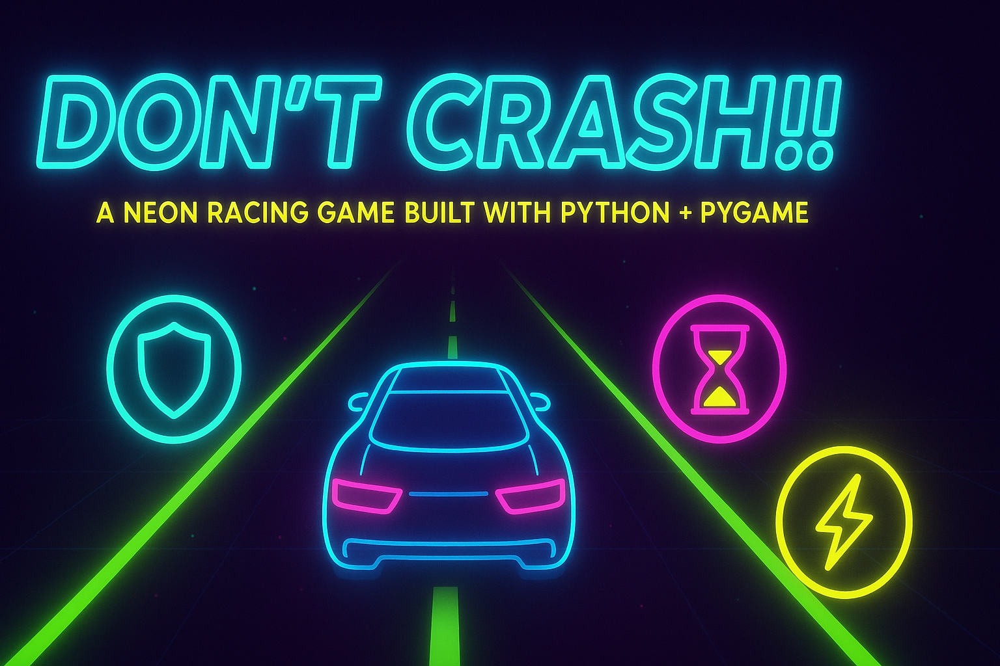

# Don't Crash!!



As I'm learning python, I built this game. DON't CRASH (Took a lot of time to figure out)
A neon-themed racing game built with Python and Pygame where your goal is to navigate through oncoming traffic while collecting power-ups to enhance your survival chances.

## 🎮 Game Features

- **Neon Visual Style**: Vibrant neon colors and glowing effects create an immersive cyberpunk atmosphere
- **Smooth Controls**: Use arrow keys or A/D for precise car movement
- **Dynamic Difficulty**: Game speed increases as your score gets higher
- **High Score System**: Compete to beat your best scores
- **Power-up System**: Three different power-ups to help you survive:
  - 🛡️ Shield: Protects you from one collision
  - ⚡ Speed Boost: Temporarily increases your maneuverability
  - ⏰ Slow Time: Slows down obstacles for easier navigation

## 🎯 How to Play

1. **Controls**:

   - Use LEFT/RIGHT arrow keys or A/D keys to move your car
   - Press M to mute/unmute music
   - Press R to restart when game over
   - Press SPACE to start the game
   - Press H to view high scores
   - Press Q to quit

2. **Gameplay**:
   - Avoid colliding with oncoming cars
   - Collect power-ups to help you survive
   - Score increases for each obstacle you successfully avoid
   - Game speed gradually increases with your score

## 🚀 Power-ups

- **Shield (Cyan)**: Absorbs one collision, allowing you to continue
- **Speed Boost (Yellow)**: Increases your movement speed for better maneuverability
- **Slow Time (Magenta)**: Slows down obstacle cars for easier dodging

## 💻 Technical Requirements

- Python 3.x
- Pygame library
- Required assets (included):
  - Car images
  - Power-up images
  - Background music
  - Sound effects
  - Custom font

## 🎨 Visual Style

The game features a distinctive neon cyberpunk aesthetic with:

- Dark background with depth effect
- Glowing neon accents
- Dynamic lighting effects
- Pulsing power-up indicators
- Smooth animations

## 🔧 Setup Instructions

1. Ensure Python 3.x is installed on your system
2. Install Pygame:
   ```bash
   pip install pygame
   ```
3. Clone or download this repository
4. Run the game:
   ```bash
   python index.py
   ```

## 🎵 Audio

- Dynamic background music
- Sound effects for:
  - Power-up collection
  - Collisions
  - Game over

## 🏆 Scoring System

- +1 point for each obstacle successfully avoided
- High scores are automatically saved
- Top 5 scores are tracked and displayed in the high scores screen

## 🔄 Game States

1. **Menu**: Main menu with game title and options
2. **Playing**: Active gameplay
3. **Game Over**: Shows final score and restart option
4. **High Scores**: Displays top 5 scores

## 📝 Credits

- Game developed using Python and Pygame
- Custom pixel art assets
- Custom sound effects and background music
- Custom font for text rendering
